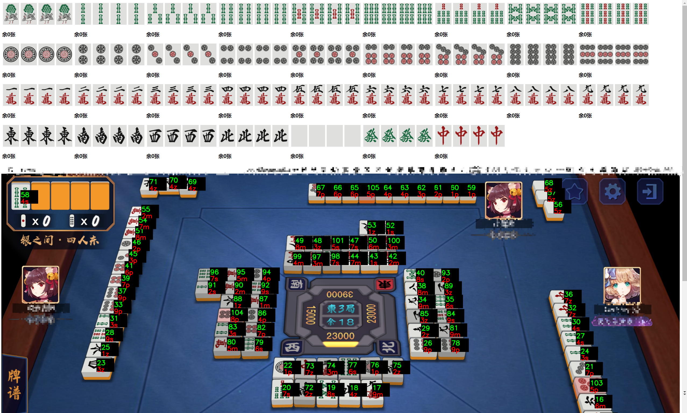

# 雀魂PC 图像识别

> 本项目使用 OpenCV 对图像进行切分后使用卷积神经网络进行识别，获取牌桌数据

## 识别过程

+ OpenCV 通过不同的阈值对画面进行二值化
+ 在每个阈值下寻找轮廓，判断面积大于一定值且高宽比在一定范围内的区域。通过蒙版将牌的周围填充白色
+ 使用卷积神经网络预测
+ 通过类别蒙版判断中心点所在的位置对应类别，用于区分舍张，副露和手牌

## 模型

本项目的large模型和tiny模型分别使用了10层和5层残差网络，运用随机生成的数据集进行训练。

## 运行方式

1. 运行recServer.py
2. 打开/page/index.html

## 继续训练

1. 修改train.py中的generate函数，该函数用于生成训练数据
2. 运行该文件
3. 从saved文件夹中拷贝出理想的weight

## 效果

> 测试电脑环境参数：
>
> 11th Gen Intel(R) Core(TM) i7-1160G7 @ 1.20GHz
>
> NVIDIA GeForce GTX 1050Ti
>
> RAM 16GB
>
> 主显示器：2650 x 1440 , 74.60Hz

### large模型

运行雀魂时同时运行程序，识别速度约2s一帧，在所有测试中准确率均为100%

### tiny模型

运行雀魂时同时运行程序，识别速度约0.5s一帧（程序延迟限制一秒一帧，可改），在测试集中牌谱上家靠左上角的牌被光线照射时有小概率出现识别错误，其他部分未见错误

## 其他

本项目参考的其他项目及其开源协议：

**雀魂牌效练习**([MaZhengKe](https://github.com/MaZhengKe)/**[mahjong](https://github.com/MaZhengKe/mahjong)**)(No License):使用了项目中的图片用于训练网络

